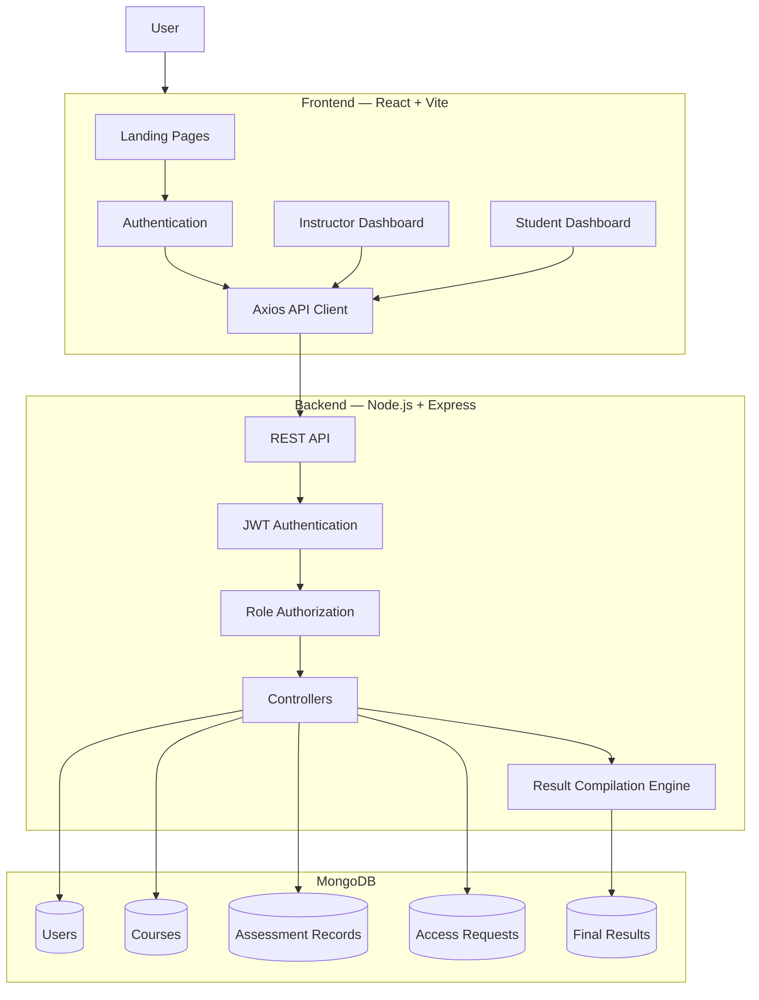
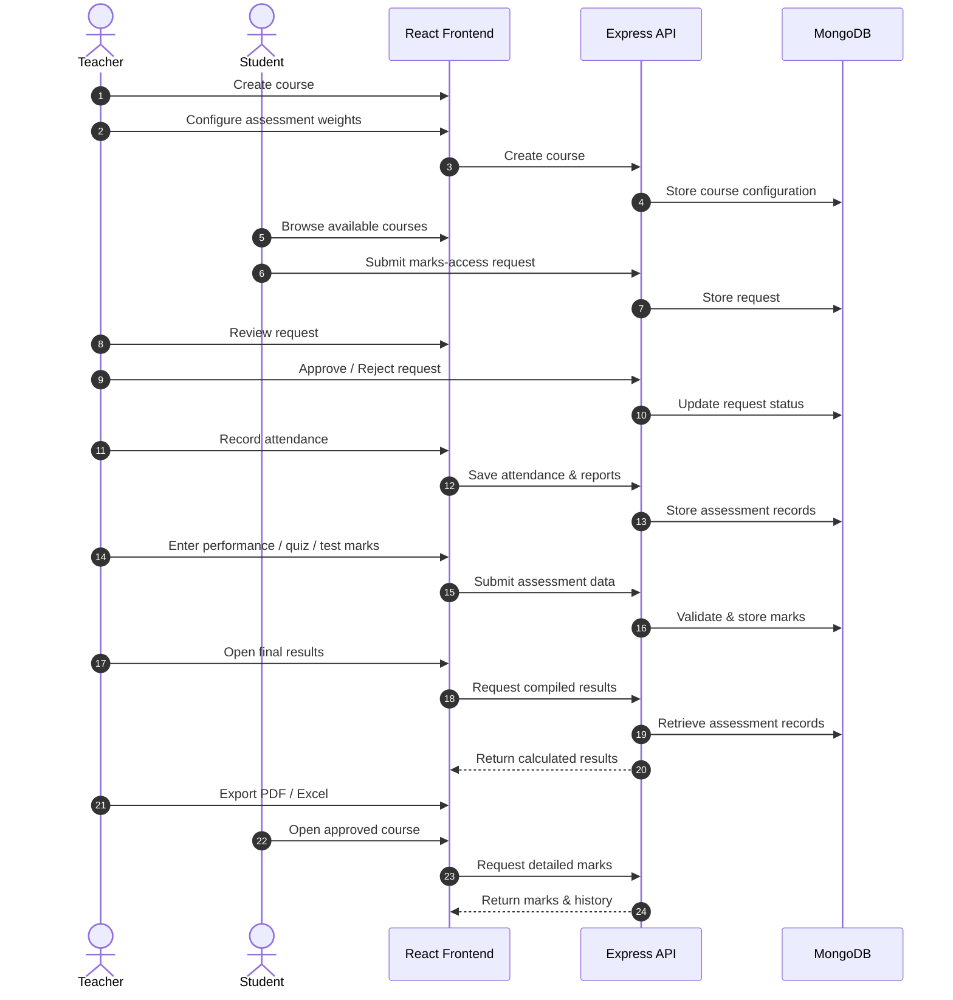
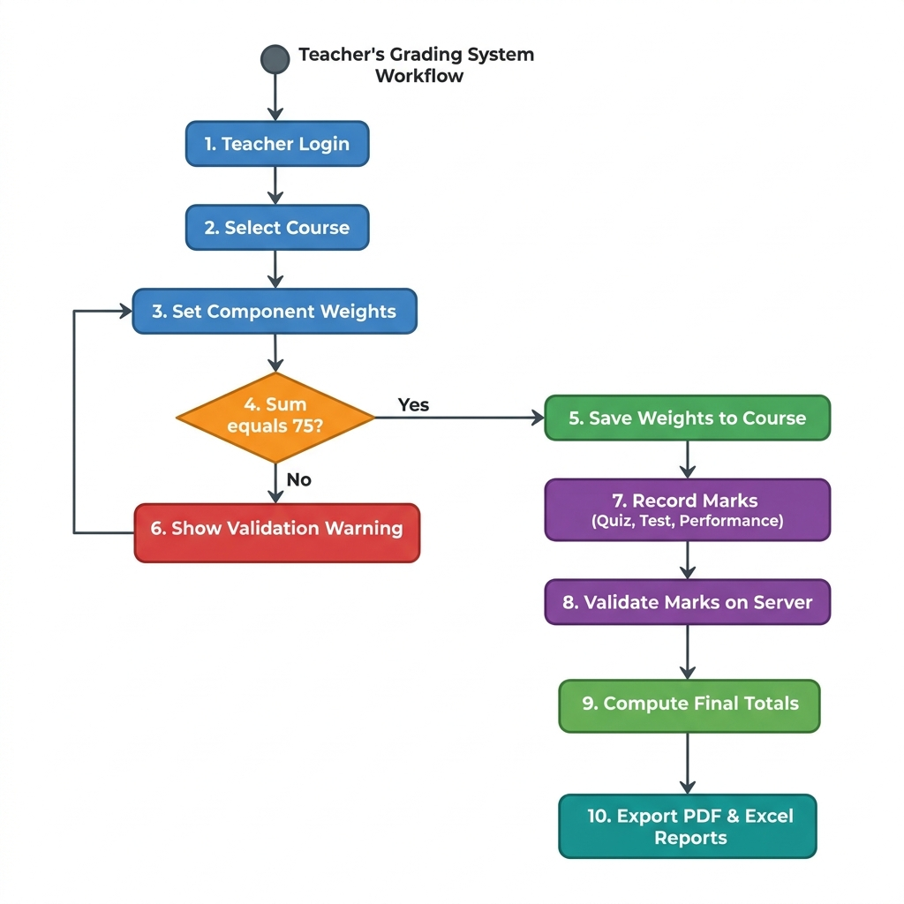
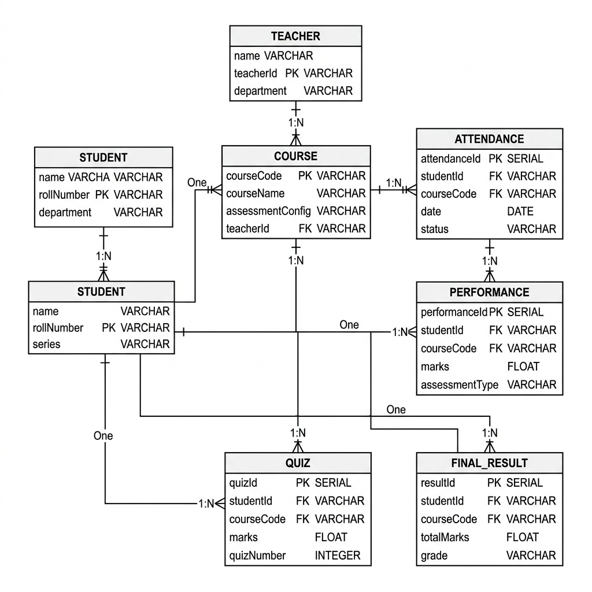
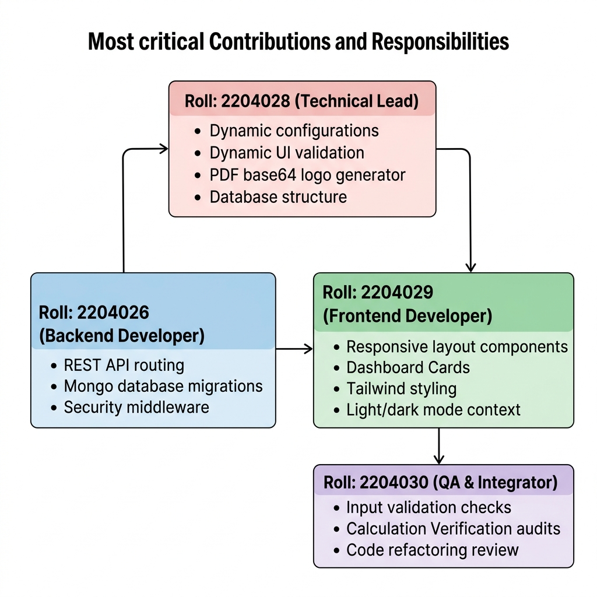

# LabEval RUET

### Continuous Laboratory Performance Evaluation & Grade Management System

[](https://react.dev/)
[](https://vitejs.dev/)
[](https://tailwindcss.com/)
[](https://nodejs.org/)
[](https://www.mongodb.com/)
[](https://opensource.org/licenses/ISC)

> **LabEval RUET** is a full-stack, role-based web platform designed to digitize continuous laboratory assessment, automate grade compilation, and provide transparent academic performance tracking for engineering and science laboratory courses.

---

## 📖 Overview

Continuous laboratory assessment typically involves multiple evaluation components such as:

* Attendance
* Lab report submission
* Daily experiment performance
* Lab quizzes
* Lab tests
* Viva, assignments, presentations, and other activities

Managing these components manually through paper registers and spreadsheets can be time-consuming, error-prone, and difficult to audit.

**LabEval RUET** provides a centralized digital workflow for instructors and students.

Instructors can configure course-specific assessment schemes, manage student records, record laboratory performance, automatically compile results, and export official result sheets.

Students can securely access their course information, monitor their attendance and assessment history, and view detailed marks after instructor approval.

### 🎯 Project Goals

* Digitize laboratory assessment workflows
* Reduce manual calculation and data-entry errors
* Standardize continuous evaluation
* Improve transparency for students
* Provide role-based access control
* Automate final mark compilation
* Generate submission-ready result sheets

---

## 👥 User Roles

| Role                 | Capabilities                                                                                                             |
| -------------------- | ------------------------------------------------------------------------------------------------------------------------ |
| 👨‍🏫 **Instructor** | Manage courses, configure grading schemes, record assessments, approve student requests, compile results, export reports |
| 🎓 **Student**       | Discover courses, request marks access, monitor performance, review attendance and assessment history                    |

---

# ✨ Features

## 👨‍🏫 Instructor Portal

### Course & Assessment Management

* Create and manage laboratory courses
* Filter courses by department and academic series
* Configure custom assessment weight distributions
* Enforce a total assessment weight of **75 marks**
* Manage student rosters

### Attendance & Report Tracking

* Record daily attendance
* Track lab report submissions
* Record attendance and reports from a unified interface
* Automatic lab-day progression
* Roll-group navigation for large cohorts
* Bulk actions:

  * Select all
  * Mark all present
  * Mark all absent
  * Undo recent changes

### Continuous Evaluation

Dedicated grading modules for:

* Daily laboratory performance
* Lab quizzes
* Lab tests
* Assignments
* Presentations
* Viva / other assessments

Additional capabilities include:

* Mark-limit validation
* Bulk mark entry
* Spreadsheet clipboard pasting
* Historical record viewing
* Course-specific assessment limits

### Automated Result Compilation

The system automatically aggregates:

* Attendance
* Lab reports
* Daily performance
* Quizzes
* Tests
* Other assessments

Results are compiled into a final score out of **75 marks** according to the configured course assessment scheme.

### Result Export

Instructors can generate:

* 📄 Landscape PDF mark sheets
* 📊 Excel `.xlsx` spreadsheets

Exported result sheets include course information, student information, assessment components, total marks, and signature areas.

### Student Access Management

Instructors can:

* View marks-access requests
* Approve requests
* Reject requests
* Control student access to detailed marks

---

# 🎓 Student Portal

### Course Discovery

Students can view active courses associated with their:

* Department
* Academic series

### Secure Marks Access

Students can submit requests to access detailed course marks.

Detailed marks remain unavailable until the instructor approves the request.

### Performance Dashboard

Students can view:

* Final score out of 75
* Category-wise performance
* Attendance percentage
* Report submission status
* Assessment breakdown
* Laboratory history

### Audit History

Expandable history views allow students to review:

* Attendance dates
* Absence records
* Report submission history
* Experiment performance
* Assessment records

---

# 🎨 User Experience

LabEval is designed with a modern academic dashboard experience.

* 🌙 Dark / light mode
* 💾 Persistent theme preference
* 📱 Responsive layouts
* 🎞️ Smooth UI transitions
* 🔔 Toast notifications
* 🧩 Reusable React components
* 🎯 Role-specific dashboards
* ⚡ Fast Vite development workflow

---

# 🏗️ System Architecture

LabEval follows a decoupled **client–server architecture**.



---

# 🔄 Application Workflow



---

# 📐 Evaluation & Scoring

LabEval supports a configurable assessment structure with a default maximum of **75 marks**.

### Default Assessment Distribution

| Component              | Default Marks |
| ---------------------- | ------------: |
| Attendance             |             5 |
| Lab Reports            |            10 |
| Continuous Performance |             5 |
| Lab Quizzes            |            30 |
| Lab Tests              |            20 |
| Others                 |             5 |
| **Total**              |        **75** |

The assessment weights can be customized by the instructor while maintaining the required total.

### Final Score

```text
Final Score =
    Attendance
  + Lab Reports
  + Continuous Performance
  + Lab Quizzes
  + Lab Tests
  + Others
```

### Attendance & Report Scaling

Attendance and report marks are calculated according to percentage-based academic thresholds configured in the application.

For attendance:

| Attendance |            Awarded Marks |
| ---------: | -----------------------: |
|      ≥ 90% | 100% of configured marks |
|     80–89% |                      90% |
|     70–79% |                      80% |
|     60–69% |                      70% |
|      < 60% |                        0 |

Students below the configured attendance threshold are visually flagged within the result interface.

---

# 🛠️ Technology Stack

| Layer                 | Technology                           |
| --------------------- | ------------------------------------ |
| **Frontend**          | React 19                             |
| **Build Tool**        | Vite                                 |
| **Routing**           | React Router DOM                     |
| **Styling**           | Tailwind CSS                         |
| **UI Components**     | DaisyUI                              |
| **Animations**        | Framer Motion                        |
| **Icons**             | Lucide React                         |
| **HTTP Client**       | Axios                                |
| **Backend**           | Node.js + Express                    |
| **Database**          | MongoDB                              |
| **ODM**               | Mongoose                             |
| **Authentication**    | JSON Web Tokens                      |
| **Password Security** | bcryptjs                             |
| **PDF Generation**    | jsPDF + AutoTable                    |
| **Excel Export**      | SheetJS / XLSX                       |
| **Logging**           | Morgan                               |
| **Deployment**        | Netlify / compatible Node.js hosting |

---

# 📁 Project Structure

```text
LabEval/
│
├── backend/
│   ├── config/
│   │   └── db.js
│   │
│   ├── controllers/
│   │   ├── authController.js
│   │   ├── courseController.js
│   │   ├── requestController.js
│   │   ├── studentController.js
│   │   ├── studentCourseController.js
│   │   ├── teacherController.js
│   │   └── teacherResultController.js
│   │
│   ├── middleware/
│   │   └── authMiddleware.js
│   │
│   ├── models/
│   │   ├── Attendance.js
│   │   ├── Course.js
│   │   ├── FinalResult.js
│   │   ├── Others.js
│   │   ├── Performance.js
│   │   ├── Quiz.js
│   │   ├── Report.js
│   │   ├── Request.js
│   │   ├── Student.js
│   │   ├── Teacher.js
│   │   └── Test.js
│   │
│   ├── seeder.js
│   ├── import_ete_students.js
│   ├── server.js
│   ├── package.json
│   └── .env.example
│
├── frontend/
│   ├── public/
│   │   └── RUET.png
│   │
│   ├── src/
│   │   ├── api/
│   │   │   └── axios.js
│   │   │
│   │   ├── components/
│   │   │   └── ProtectedRoute.jsx
│   │   │
│   │   ├── context/
│   │   │   ├── AuthContext.jsx
│   │   │   └── ThemeContext.jsx
│   │   │
│   │   ├── layouts/
│   │   │   ├── DashboardLayout.jsx
│   │   │   └── LandingLayout.jsx
│   │   │
│   │   ├── pages/
│   │   │   ├── auth/
│   │   │   ├── public/
│   │   │   ├── student/
│   │   │   └── teacher/
│   │   │
│   │   ├── App.jsx
│   │   ├── main.jsx
│   │   └── index.css
│   │
│   ├── package.json
│   ├── vite.config.js
│   └── .env.example
│
├── er_diagram.png
├── workflow_flowchart.png
├── team_contributions.png
├── PROJECT_REPORT.md
├── netlify.toml
└── README.md
```

---

# 🔌 API Overview

The backend exposes RESTful APIs under:

```text
/api/auth
/api/teacher
/api/student
```

Protected endpoints use JWT-based authentication.

```http
Authorization: Bearer <JWT>
```

## Authentication

| Method | Endpoint                     | Description               | Access |
| ------ | ---------------------------- | ------------------------- | ------ |
| POST   | `/api/auth/student-register` | Register student          | Public |
| POST   | `/api/auth/student-login`    | Student authentication    | Public |
| POST   | `/api/auth/teacher-register` | Register instructor       | Public |
| POST   | `/api/auth/teacher-login`    | Instructor authentication | Public |

## Instructor APIs

| Method | Endpoint                          | Description                       |
| ------ | --------------------------------- | --------------------------------- |
| GET    | `/api/teacher/courses`            | Retrieve instructor courses       |
| POST   | `/api/teacher/courses`            | Create course                     |
| DELETE | `/api/teacher/courses/:id`        | Delete course                     |
| GET    | `/api/teacher/courses/:id/config` | Retrieve assessment configuration |
| PATCH  | `/api/teacher/courses/:id/config` | Update assessment configuration   |
| GET    | `/api/teacher/students/any`       | Retrieve student roster           |
| POST   | `/api/teacher/attendance/bulk`    | Bulk attendance/report entry      |
| POST   | `/api/teacher/attendance`         | Save attendance                   |
| POST   | `/api/teacher/report`             | Save report status                |
| POST   | `/api/teacher/performance`        | Save performance marks            |
| POST   | `/api/teacher/quiz`               | Save quiz marks                   |
| POST   | `/api/teacher/test`               | Save test marks                   |
| POST   | `/api/teacher/others`             | Save other assessment marks       |
| GET    | `/api/teacher/results/:courseId`  | Compile course results            |
| GET    | `/api/teacher/requests`           | Retrieve access requests          |
| PATCH  | `/api/teacher/requests/:id`       | Approve/reject request            |

## Student APIs

| Method | Endpoint                         | Description                    |
| ------ | -------------------------------- | ------------------------------ |
| GET    | `/api/student/courses`           | Retrieve available courses     |
| POST   | `/api/student/request`           | Submit marks-access request    |
| GET    | `/api/student/requests`          | Retrieve request history       |
| GET    | `/api/student/marks/:courseCode` | Retrieve approved course marks |

> **Note:** Endpoint details should be kept synchronized with the backend implementation whenever routes are modified.

---

# 🔐 Security

LabEval implements multiple layers of access control.

### JWT Authentication

Authenticated requests are protected using JSON Web Tokens.

### Role-Based Authorization

Backend middleware distinguishes between:

* Student
* Instructor

Unauthorized roles are prevented from accessing restricted resources.

### Protected Frontend Routes

React route guards prevent unauthenticated users and incorrect roles from accessing protected dashboard routes.

### Password Hashing

User passwords are hashed using `bcryptjs` before database storage.

### Marks Access Control

Students cannot directly access detailed marks unless the corresponding instructor has approved their access request.

### Mark Validation

Assessment values are validated against the configured course limits before being persisted.

### Environment-Based Secrets

Sensitive configuration such as:

* MongoDB credentials
* JWT secrets
* API URLs

is supplied through environment variables rather than committed directly to the repository.

---

# 🚀 Getting Started

## Prerequisites

Make sure the following are installed:

* **Node.js** 18+
* **npm** 9+
* **MongoDB** or a MongoDB Atlas cluster

---

## 1. Clone the Repository

```bash
git clone https://github.com/jahid1915/LabEval.git
cd LabEval
```

---

## 2. Configure the Backend

```bash
cd backend
npm install
```

Create:

```text
backend/.env
```

using the provided `.env.example`.

Example:

```env
PORT=5000
MONGO_URI=your_mongodb_connection_string
JWT_SECRET=your_secure_jwt_secret
NODE_ENV=development
FRONTEND_URL=http://localhost:5173
```

---

## 3. Configure the Frontend

```bash
cd ../frontend
npm install
```

Create:

```text
frontend/.env
```

Example:

```env
VITE_API_BASE_URL=http://localhost:5000/api
```

---

# 🌱 Database Seeding

If the repository includes the provided seed data, run:

```bash
cd backend
node seeder.js
```

For importing the provided student dataset:

```bash
node import_ete_students.js
```

Use these scripts only when the corresponding database/configuration requirements are satisfied.

---

# ▶️ Run the Application

The frontend and backend run independently.

### Terminal 1 — Backend

```bash
cd backend
npm run dev
```

The API will run on:

```text
http://localhost:5000
```

### Terminal 2 — Frontend

```bash
cd frontend
npm run dev
```

The frontend will typically be available at:

```text
http://localhost:5173
```

---

# 🖼️ Visual Documentation

### Application Workflow



### Database ER Diagram



### Team Contributions



---

# 🌐 Deployment

## Frontend

The frontend can be deployed to platforms supporting Vite/SPA applications, including Netlify.

Production build:

```bash
cd frontend
npm run build
```

Build output:

```text
frontend/dist
```

The repository includes SPA routing configuration for client-side routes.

## Backend

The Express backend can be deployed to a Node.js-compatible hosting platform.

Production start command:

```bash
npm start
```

Configure the required production environment variables on the hosting platform.

> **Important:** Replace development URLs and secrets with production values before deployment.

---

# 🧪 Testing

Automated unit and integration test suites are not currently included in the repository.

Future testing can include:

* Frontend component tests
* API integration tests
* Authentication tests
* Result calculation tests
* Role-based authorization tests
* End-to-end workflow tests

Potential tools include Vitest, Jest, Supertest, and Playwright.

---

# 🗺️ Roadmap

Potential future improvements include:

* [ ] Multi-instructor course collaboration
* [ ] Lab assistant role
* [ ] Email notifications
* [ ] Push notifications
* [ ] Automated attendance alerts
* [ ] Direct student lab-report submission
* [ ] Cloud file storage integration
* [ ] Advanced performance analytics
* [ ] Automated CI/CD pipelines
* [ ] Comprehensive automated testing
* [ ] Institution-level administration dashboard

---

# 🤝 Contributing

Contributions, issues, and feature requests are welcome.

### Development Workflow

```bash
# Create a feature branch
git checkout -b feature/your-feature

# Stage changes
git add .

# Commit changes
git commit -m "Add your feature"

# Push branch
git push origin feature/your-feature
```

Then open a Pull Request on GitHub.

---

# 📄 License

This project is licensed under the **ISC License**.

See the repository license file for the complete license text.

---

# 👨‍💻 Author

### Jahid Hasan

Full-Stack Developer • Engineering Student • AI & Automation Enthusiast

* GitHub: [@jahid1915](https://github.com/jahid1915)
* Email: `jahidhasan29004@gmail.com`

---

# 🙏 Acknowledgements

Special thanks to:

* **Rajshahi University of Engineering & Technology (RUET)** for the academic context and laboratory evaluation workflow that inspired the project.
* **React** for the frontend architecture.
* **Vite** for the development and build environment.
* **Tailwind CSS** and **DaisyUI** for the interface system.
* **Framer Motion** for UI animations.
* **Lucide** for iconography.
* **MongoDB** for database infrastructure.
* **Express.js** for backend API development.

---

<div align="center">

### ⭐ If you find LabEval useful, consider giving the repository a star.

**Built with React, Node.js, Express, MongoDB & a focus on better academic workflows.**

</div>
